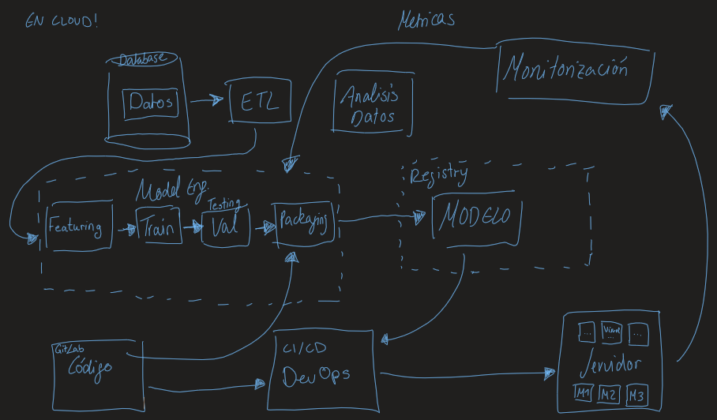

### Clase del 23 de junio de 2023 con Daniel Ruiz 
# Machine Learning Operations (MLOps)

## Introducción
Machine Learning Operations (MLOps) es una práctica que busca unir el desarrollo de software con el aprendizaje automático. El objetivo es que los modelos de aprendizaje automático se puedan desarrollar, entrenar, implementar y administrar de manera rápida y confiable.

## ML Project Lifecycle
El ciclo de vida de un proyecto de aprendizaje automático se puede dividir en 3 etapas:
- **Business & Data Understanding**: En esta etapa se entiende el negocio y los datos. Se define el problema y se entiende el contexto y cuales son los datos disponibles y necesarios.
    - ML Project Ideation: Se define el problema y se entiende el contexto en el canvas de ML: background, value, data, metrics, risks, costs, timeline, stakeholders, etc.
- **Model Development**: En esta etapa se desarrolla el modelo.
- **Model Operations**: En esta etapa se opera/ produce el modelo. Se define los procesos de producción, monitoreo y retiro.

## Orígenes de MLOps
MLOps tiene sus orígenes en DevOps, que es una práctica que busca unir el desarrollo de software con las operaciones de software. El objetivo es que los cambios en el software se puedan desarrollar, probar, implementar y monitorear de manera rápida y confiable.

Cuando se despleza AI en producción, también hay la necesidad de communicación en el equipo debido a que es más que solo computar un conjunto de salidas para las entradas determinadas. Se debe tener en cuenta que el modelo de aprendizaje automático es solo una parte de un sistema más grande. Por lo tanto, se debe tener en cuenta el ciclo de vida completo del sistema, incluido el ciclo de vida del modelo de aprendizaje automático, incluso los diferentes roles y responsabilidades de los equipos involucrados (por ejemplo, científicos de datos, ingenieros de aprendizaje automático, ingenieros de software, ingenieros de datos, ingenieros de DevOps, etc.).

Hay los siguientes challenges en el deployment de AI:
- model performance
- scalability
- data quality & consistency
- integration with existing systems
- security & privacy
- maintainance & updates

Por lo tanto, se creó MLOps para ayudar a los equipos a resolver estos problemas. Un MLOps Engineer tiene un perfil que consta de treis partes: Machine Learning, Data Engineering y DevOps.

## MLOps Framework

## MLOps Principles
1. **CI/CD automation:** Automatizar el ciclo de vida del modelo de aprendizaje automático.
2. **Workflow orchestration:** Coordinar los diferentes pasos del ciclo de vida del modelo de aprendizaje automático. Airflow, Kubeflow, MLFlow
3. **Reproducibility:** Reproducir los resultados de los modelos de aprendizaje automático. Docker, Kubernetes, DVC
4. **Versioning of data, models and code:** Versionar los datos, modelos y código. Git, DVC
5. **Collaboration:** Reducir los silos entre los equipos de aprendizaje automático y de operaciones. Git, Github, Gitlab
6. **Continous ML training & evaluation:** Entrenar y evaluar los modelos de aprendizaje automático de manera continua (scheduled). Kubeflow, MLFlow
7. **ML metadata tracking:** parametros, performance metrics, data y code usado para entrenar los modelos de aprendizaje automático.MLFlow, Kubeflow
8. **Continous monitoring:** Monitorear los modelos de aprendizaje automático en producción de manera continua (periódico). Prometheus, Grafana
9. **Feedback loops:** Quality feedback loop para mejorar los modelos de aprendizaje automático. Prometheus, Grafana

## MLOps Tools

### Tipos de herramientas de MLOps
Se distinguen los siguientes 3 tipos de herramientas de implementar MLOps:
- **Open Source:** Herramientas de código abierto, por ejemplo, Kubeflow, MLFlow, DVC, etc.
- **Paid Services:** Servicios pagos con una empresa detrás, por ejemplo, AWS SageMaker, Google Cloud AI Platform, etc.
- **Cloud Platforms:** Plataformas en la nube, por ejemplo, AWS, Google Cloud, Azure, etc.

Los 3 tipos tienen sus ventajas y desventajas. Por ejemplo, las herramientas de código abierto son gratuitas, pero se necesita más tiempo para configurarlas y mantenerlas. Los servicios pagos son fáciles de usar, pero son más caros. Las plataformas en la nube son fáciles de usar, son escalables y tienen un precio razonable, pero no son tan flexibles como las herramientas de código abierto.

### Niveles de MLOps
Según el tamaño de la empresa, se puede usar diferentes herramientas, hay diferentes niveles en MLOps. También depende del caso de uso, los recursos y el presupuesto, que no hay una solución única para todos los casos.

- **Level 0 - Manual Process:** los modelos de aprendizaje automático se desarrollan y operan manualmente. No hay automatización. Hay el riesgo de errores humanos, tarda más tiempo en producción y no se puede estandardizar ni escalar tan facil.
- **Level 1 - ML pipeline automation:** los modelos de aprendizaje automático se desarrollan y operan con pipelines de aprendizaje automático. Hay automatización, pero el model deployment en producción todavía es manual. Hay el riesgo de bottlenecks en el deployment, inconsistencia entre los ambientes de desarrollo y producción y no se puede escalar tan facil.
- **Level 2 - CI/CD automation:** los modelos de aprendizaje automático se desarrollan y operan con pipelines de manera end-to-end con CI/CD. Incluye el testing automatizado, el deployment automatizado y el monitoreo automatizado que facilita la collaboration entre los equipos de desarrollo y operaciones, eliminando los silos. Eso es muy complicado de conseguir y a veces no tiene sentido de hacerlo según el caso de uso.

## Edge deployment
Edge deployment es el deployment de modelos de aprendizaje automático en dispositivos edge, por ejemplo, en dispositivos móviles, en dispositivos IoT, en dispositivos de automóviles, etc. El objetivo es que los modelos de aprendizaje automático se puedan ejecutar en dispositivos edge sin conexión a Internet. 

Librerías de ML para deployment en edge:
- Tensor RT (NVIDIA)
- Tensorflow Lite
- ONNX Runtime

## Transición de MLOps a LLMLOps
Large Language Models Operations (LLMLOps) es un término que se refiere a las operaciones de modelos de lenguaje grandes. En resumen, LLMOps es MLOps para LLMs. Esto significa que LLMOps es un nuevo conjunto de herramientas y mejores prácticas para administrar el ciclo de vida de las aplicaciones impulsadas por LLM, incluido el desarrollo, la implementación y el mantenimiento.

Sus requisitos son los siguientes:
- **Prompt Registry:** Un registro de prompts para que los usuarios puedan compartir y reutilizar prompts.
- **Vector databases:** Una base de datos de vectores para almacenar los vectores de contexto de los prompts.
- **Human in the loop:** Requieren soluciones creativos debido a que las salidas son subjetivas.
- **Architecture & Infrastructure:** Requieren una supervisión
y mantenimiento diferentes (más demanda) que los sistemas de ML tradicionales. 

## Conceptos de MLOps
- **CI/CD:** Continuous Integration/ Continuous Delivery
- **Dev/Pre-Prod/Prod:** Development/ Testing/ Pre-Production/ Production
- **Testing:** Unit Testing/ Integration Testing/ End-to-End Testing/ UI Testing
- **Scalability:** Vertical Scaling/ Horizontal Scaling

## Herramientas de MLOps
- Model Serving
- Model Registry
- Pipelines
